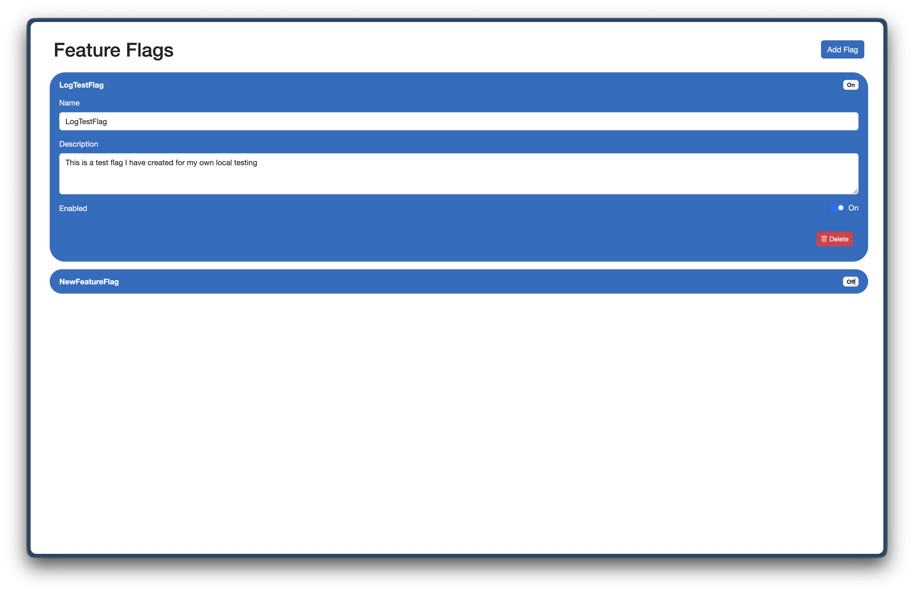

# 🚩 Feature Flags Dashboard

A simple full-stack feature flag management dashboard built with **Blazor Server**, **EF Core**, and **SQLite**.



This application allows you to:

* Create and manage feature flags
* Toggle flags on/off
* Persist flags across sessions
* Expose a REST API for consuming feature flags in other applications

---

## ✨ Features

* 🎛️ Interactive UI with expandable "pill" components
* 💾 Persistent storage using SQLite
* 🔄 Real-time updates with Blazor Server
* 🚫 Duplicate flag name prevention
* 🔌 REST API endpoint for external consumers
* ⚡ Lightweight and easy to run locally

---

## 🧱 Tech Stack

* **Frontend / Backend**: Blazor Server (.NET 10)
* **UI Components**: Blazor Bootstrap
* **ORM**: Entity Framework Core
* **Database**: SQLite
* **API**: ASP.NET Core Minimal APIs

---

## 🚀 Getting Started

### 1. Clone the repository

```bash
git clone https://github.com/your-username/feature-flags.git
cd feature-flags
```

### 2. Install dependencies

```bash
dotnet restore
```

### 3. Apply database migrations

```bash
dotnet ef migrations add InitialCreate
dotnet ef database update
```

### 4. Run the app

```bash
dotnet run
```

Open your browser at:

```
https://localhost:xxxx
```

(most likely http://localhost:5081/)

---

## 📡 API Usage

### Get all feature flags

```
curl --location 'http://localhost:5081/api/featureflags' \
--header 'user: lfoster03'
```

### Example Response

```json
{
  "featureFlags": {
    "NewUI": true,
    "BetaCheckout": false
  }
}
```

---

## ⚠️ Validation

* Feature flag names are **unique**
* Duplicate names are prevented via:

  * Database unique index
  * Application-level validation
  * Graceful UI error handling

---

## 📁 Project Structure

```
/Components
  /Shared
    Pill.razor          # Feature flag UI component
/Data
  FeatureFlagDbContext.cs
/Models
  FeatureFlag.cs
Program.cs              # App + API setup
```

---

## 🛠️ Development Notes

* SQLite database file: `featureflags.db`
* Migrations stored in `/Migrations`
* Uses `DbContext` injection for data access
* UI changes auto-save to database

---

## 🤝 Contributing

Feel free to fork the repo and submit PRs!

---

## 📄 License

MIT License

---
