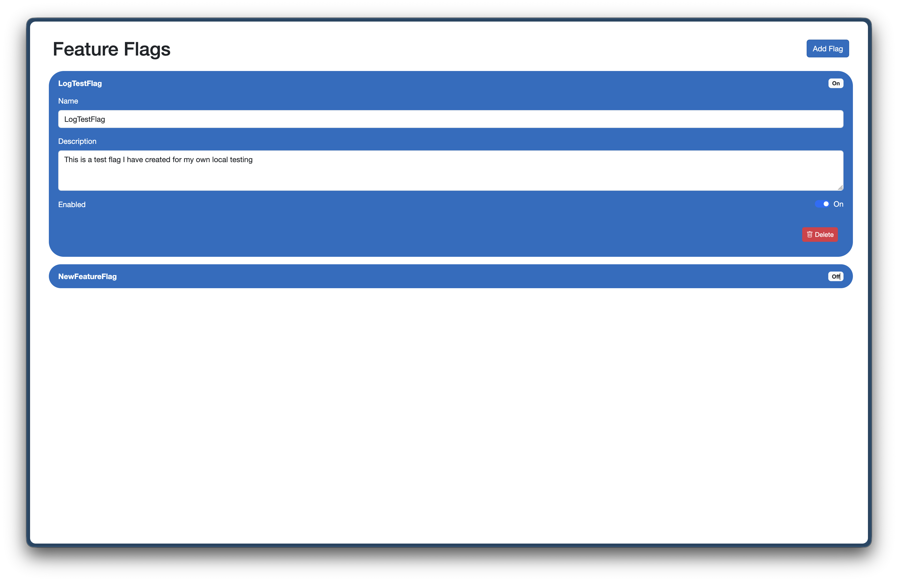

# 🚩 Feature Flags Dashboard

A simple full-stack feature flag management dashboard built with **Blazor Server**, **EF Core**, and **SQLite**.



This application allows you to:

* Create and manage feature flags
* Toggle flags on/off
* Persist flags across sessions
* Expose a REST API for consuming feature flags in other applications

---

## ✨ Features

* 🎛️ Interactive UI with expandable "pill" components
* 💾 Persistent storage using SQLite
* 🔄 Real-time updates with Blazor Server
* 🚫 Duplicate flag name prevention
* 🔌 REST API endpoint for external consumers
* 📄 OpenAPI spec for SDK generation
* ⚡ Lightweight and easy to run locally

---

## 🧱 Tech Stack

* **Frontend / Backend**: Blazor Server (.NET 10)
* **UI Components**: Blazor Bootstrap
* **ORM**: Entity Framework Core
* **Database**: SQLite
* **API**: ASP.NET Core Minimal APIs

---

## 🚀 Getting Started

### 1. Clone the repository

```bash
git clone https://github.com/your-username/feature-flags.git
cd feature-flags
```

### 2. Install dependencies

```bash
dotnet restore
brew install --cask docker
```

### 3. Apply database migrations

```bash
dotnet ef migrations add InitialCreate
dotnet ef database update
```

### 4. Run the app

```bash
./scripts/docker-up.sh
```

Open your browser at:

```
http://localhost:<selected-port>
```

### 5. Run with Docker

Build and run the container directly:

```bash
docker build -t featureflags .
docker run --rm -p 8080:8080 -v featureflags-data:/data featureflags
```

Or use Docker Compose:

```bash
./scripts/docker-up.sh
```

Then open:

```
http://localhost:<selected-port>
```

Notes:

* The container stores the SQLite database at `/data/featureflags.db`
* `docker-compose.yml` mounts `/data` as a named volume so data survives container restarts
* The app still applies EF Core migrations automatically on startup
* `scripts/docker-up.sh` picks the first available host port from `8080` to `8090`
* You can override the search range: `./scripts/docker-up.sh 8085 8100`
* The script builds the current checkout and starts only the app and database; the production Caddy proxy is not started locally

---

## 📡 API Usage

The OpenAPI spec is generated by the app at:

```
http://localhost:<selected-port>/openapi/v1.json
```

The committed SDK input lives at `openapi/v1.json`. After the app is running, regenerate it from the runtime `Microsoft.AspNetCore.OpenApi` output with:

```bash
curl --silent --show-error --fail \
  http://localhost:<selected-port>/openapi/v1.json \
  --output openapi/v1.json
```

If you only need to regenerate the spec and do not have the database running, start the app with startup migrations disabled:

```bash
SkipDatabaseMigrations=true dotnet run \
  --project src/featureflags/FeatureFlags.csproj \
  --no-launch-profile \
  --urls http://localhost:8080
```

### Get all feature flags

```bash
curl --location 'http://localhost:<selected-port>/api/v1/featureflags' \
  --header 'X-API-Key: <client-key>' \
  --header 'user: <userID>'
```

### Example Response

```json
{
  "featureFlags": {
    "NewUI": true,
    "BetaCheckout": false
  },
  "configs": {
    "Theme": {
      "color": "blue",
      "layout": "compact"
    }
  }
}
```

---

## ⚠️ Validation

* Feature flag names are **unique**
* Duplicate names are prevented via:

  * Database unique index
  * Application-level validation
  * Graceful UI error handling

---

## 📁 Project Structure

```
/Components
  /Shared
    Pill.razor          # Feature flag UI component
/Data
  FeatureFlagDbContext.cs
/Models
  FeatureFlag.cs
Program.cs              # App + API setup
```

---

## 🛠️ Development Notes

* SQLite database file: `featureflags.db`
* Migrations stored in `/Migrations`
* Uses `DbContext` injection for data access
* UI changes auto-save to database
* Override the runtime DB path with `ConnectionStrings__FeatureFlags`

---

## 🤝 Contributing

Feel free to fork the repo and submit PRs!

---

## 📄 License

MIT License

---

## Project invitation email

Invitations expire after seven days. Only an Admin or Owner can send or revoke
one. Recipients must sign in with the invited email and explicitly join the
project. Pending invitations do not grant access. Resend renews the link and
invalidates the previous one; allow one minute between resends. Each project
can issue up to 20 invitations/renewals per hour.

Development writes `.eml` files to `src/featureflags/App_Data/invitation-mail/`.
Open them in a mail client to follow the invitation. This folder is ignored by
Git and is not publicly served. Set `InvitationEmail__PublicBaseUrl` to the
local URL you actually use (including the port).

For real SMTP delivery, configure these environment variables or user secrets:

| Setting | Value |
| --- | --- |
| `InvitationEmail__PublicBaseUrl` | Public HTTPS application URL |
| `InvitationEmail__From` | Verified sender address, optionally with display name |
| `InvitationEmail__Host` | SMTP server hostname |
| `InvitationEmail__Port` | Usually `587` or `465` |
| `InvitationEmail__Security` | `StartTls` for required STARTTLS, or `SslOnConnect` |
| `InvitationEmail__Username` | SMTP username, if authentication is required |
| `InvitationEmail__Password` | SMTP password, supplied through secrets |

Docker Compose forwards the same settings from its environment or ignored `.env` file.

Clear `InvitationEmail__PickupDirectory` when testing SMTP in Development.
Production rejects pickup mode and requires TLS. Configure the sender/domain
with your email provider. SMTP acceptance does not guarantee inbox delivery;
provider bounces and spam filtering still apply.

If sending fails, the saved invitation remains visible and can be resent. The
application does not store raw invitation tokens, so resend always issues a
new link. A renewed-link audit event records that change even if email delivery
subsequently fails. Mail credentials and invitation links must not be committed
or written to application logs.

Run the invitation browser journeys against a Development app and its preview
folder with `BASE_URL=http://127.0.0.1:8080 INVITATION_MAIL_DIR=/absolute/path/to/invitation-mail npx playwright test tests/visual/invitations.spec.js`.
The dedicated Invitation journeys workflow runs this in CI with a disposable
database and local emails.
